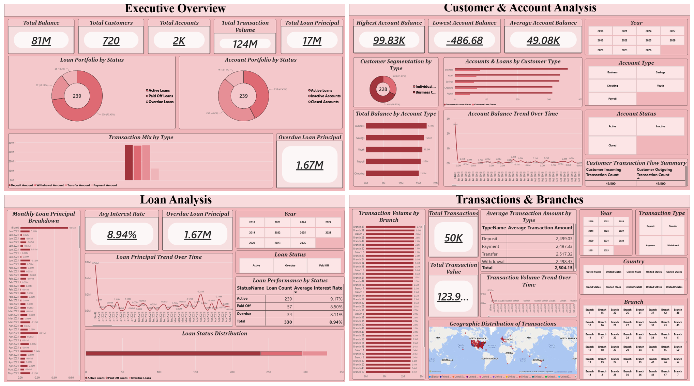
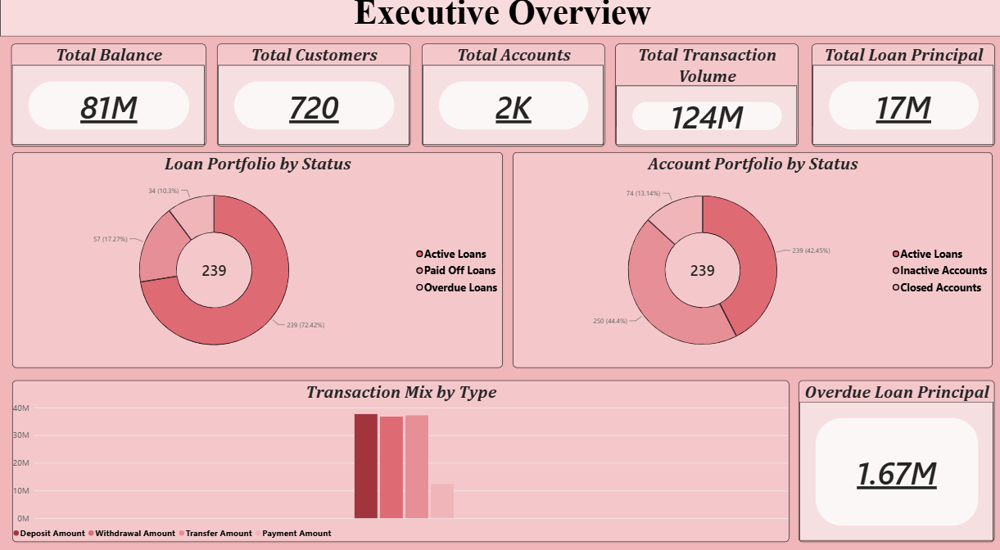
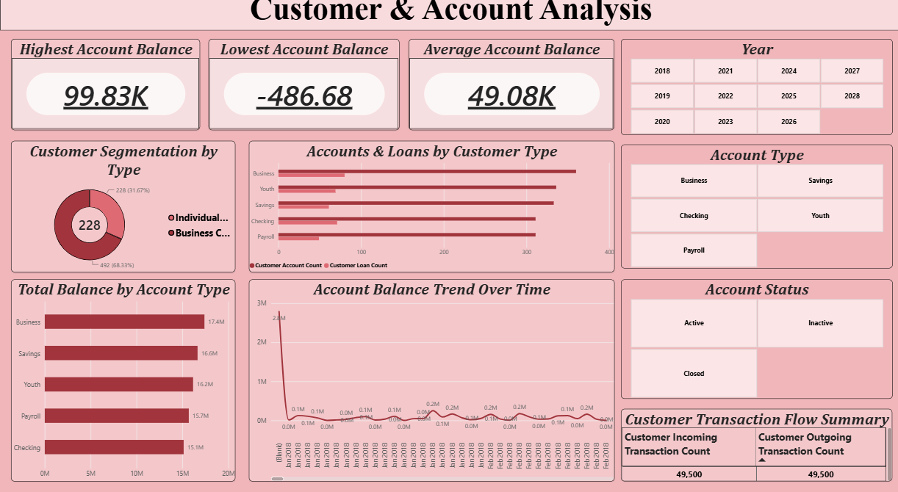
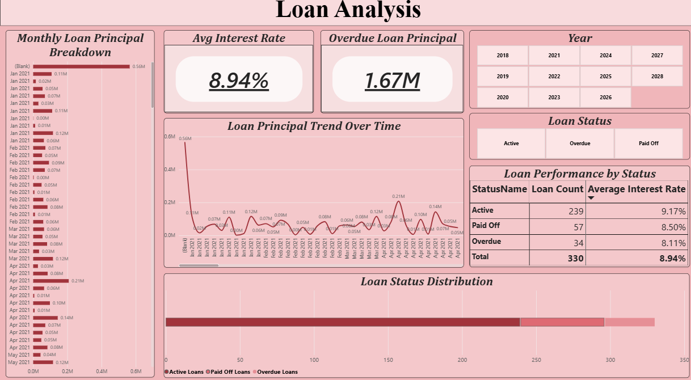
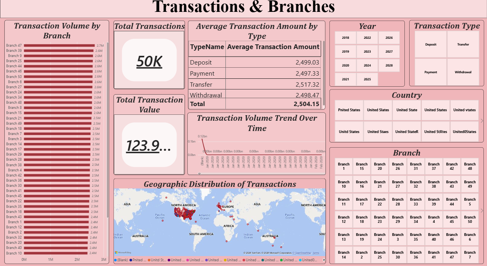

# Banking Performance Dashboard (PBI5)

A 4-page Power BI dashboard analysing a banking dataset of 1,651 accounts, 720 customers, 330 loans, 49,500 transactions, and 50 branches — built on a star-schema semantic model with 38 DAX measures organised into display folders and three role-playing date tables.

## Overview

This project models a retail bank's core data — accounts, customers, loans, transactions, and branches — into a single Power BI semantic model, then surfaces it across four focused report pages: an executive summary, customer & account analysis, loan portfolio analysis, and transaction/branch analysis.

| Metric | Value |
|---|---|
| Total Balance | ₹8,10,36,977 |
| Total Customers | 720 (228 Individual, 492 Business) |
| Total Accounts | 1,651 |
| Total Loan Principal | ₹1,70,87,413 across 330 loans |
| Total Transaction Value | ₹12,39,55,500 across 49,500 transactions |
| Branches | 50, evenly balanced (~14% spread top to bottom) |

## Data Model

Star schema with five fact/dimension tables (`accounts`, `customers`, `loans`, `transactions`, `addresses`) plus lookup tables for statuses and types (`account_statuses`, `account_types`, `customer_types`, `loan_statuses`, `transaction_types`) and `branches`.

**Measures:** all 38 DAX measures live in a single `_Measures` table (not scattered across fact tables), organised into 5 display folders — Accounts, Customers, Loans, Transactions, Addresses.

**Date tables:** three separate role-playing date tables — `_Date Accounts`, `_Date Loans`, `_Date Transactions` — each with its own active relationship to its subject's date column (OpeningDate, StartDate, TransactionDate respectively). Three tables were used instead of one shared date table because `loans` and `transactions` are already connected to `accounts`, and a single shared date table would create an ambiguous relationship path (`loans` → `accounts` → `Date` vs. `loans` → `Date` directly) that Power BI doesn't allow active at the same time.

## Dashboard Pages

| Page | Focus |
|---|---|
| 1. Executive Overview | Headline KPI cards, loan/account status donuts, transaction mix, overdue risk |
| 2. Customer & Account Analysis | Customer segmentation, balance by account type, balance trend, transaction flow |
| 3. Loan Analysis | Loan performance by status, interest rate breakdown, principal trend |
| 4. Transactions & Branches | Transaction mix and trend, branch volume ranking, geographic distribution |

## Screenshots

**Executive Overview**

**Customer & Account Analysis**

**Loan Analysis**

**Transactions & Branches**

## Key Insights

- Loan portfolio is healthy by count (72.4% Active, only 10.3% Overdue), and overdue risk is proportionate — Overdue loans hold roughly the same share of total principal as they do of loan count, so risk isn't concentrated in unusually large loans.
- Deposit, Withdrawal, and Transfer transaction types are nearly identical in both count and average size; Payment is a clear minority (4,958 vs. ~14,700–15,100 for the others) but at the same average value.
- Branch-level activity is very evenly distributed — the busiest and quietest of the 50 branches differ by only ~14%.
- Balance is well spread across all five account types, with no single type dominating the deposit base.

A full write-up with detailed figures, DAX logic, and data-quality notes is in [`docs/analysis-report.docx`](docs/analysis-report.docx).

## Tech Stack

- **Power BI Desktop** — data modelling, DAX measures, report design
- **DAX** — 38 measures across Accounts, Customers, Loans, Transactions, and Addresses
- **Star schema** — fact/dimension modelling with role-playing date dimensions

## Author

**Pothi Raja D**
B.Com Fintech with AI, AMET University, Chennai
[GitHub](https://github.com/PothiRaja007)
